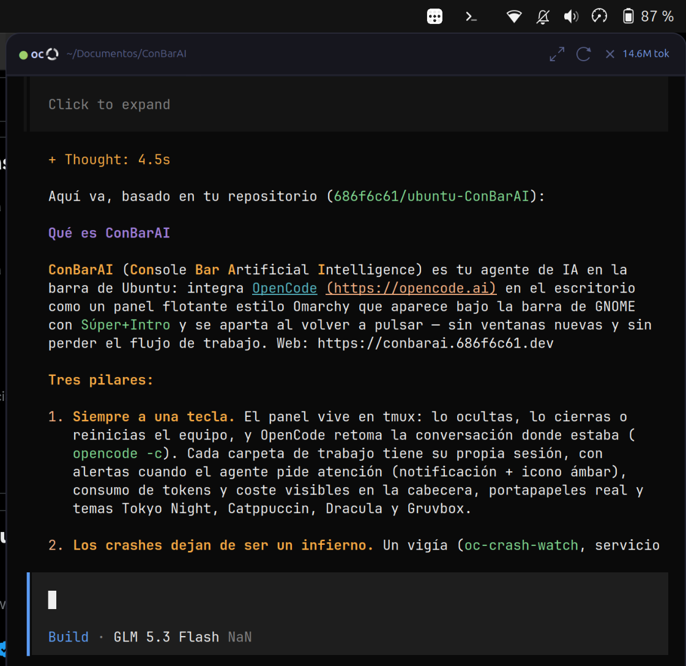
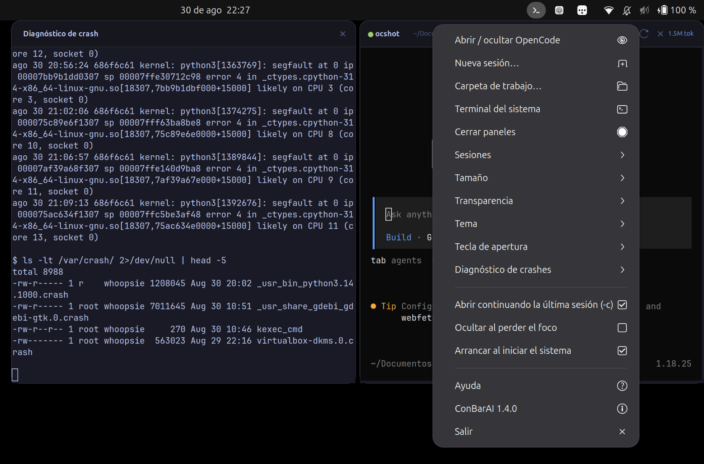
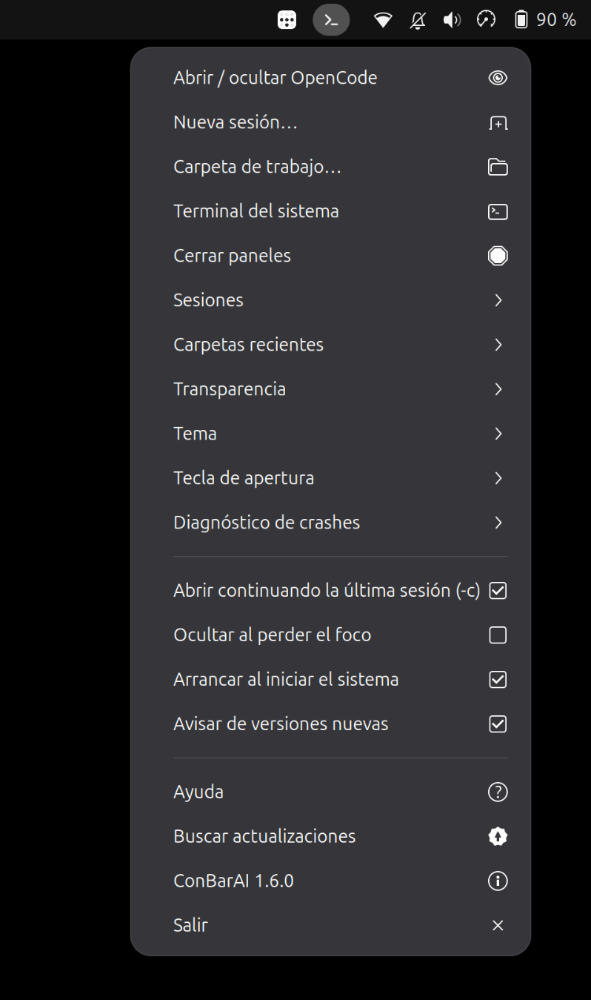
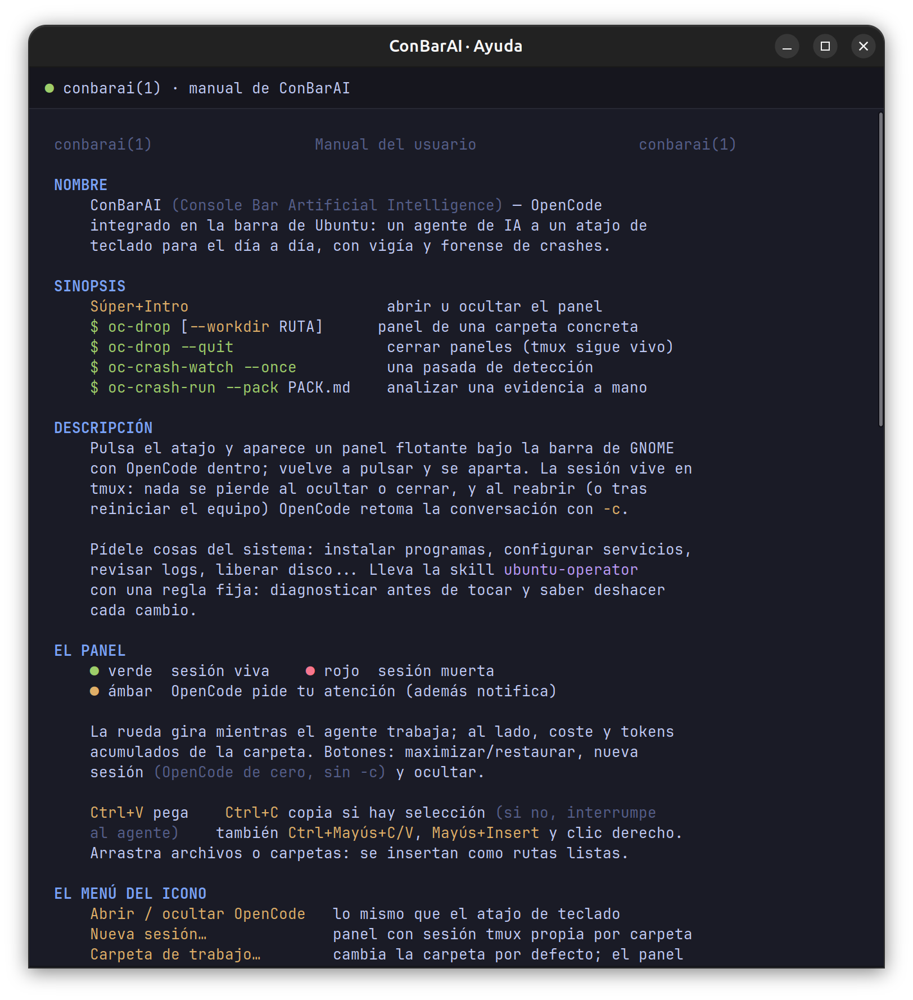

# ConBarAI

**Your AI agent in the Ubuntu top bar.** One keystroke away, always at
hand — with a bonus mission: turning Linux crashes into reports with a
cause and a fix.

**Website**: https://conbarai.686f6c61.dev

English · [Español](README.md)

---

**ConBarAI** (**Con**sole **Bar** **A**rtificial **I**ntelligence) brings
[OpenCode](https://opencode.ai) to your desktop: an Omarchy-style floating
panel that drops down under the GNOME bar when you press `Super+Enter`,
and slides away when you press it again. No new windows, no broken flow.



## Why ConBarAI

**Always one key away.** The panel lives in `tmux`: hide it, close it or
reboot the machine — OpenCode is still there and resumes the conversation
where it left off (`opencode -c`). Every working folder gets its own
session.

**Crashes stop being hell.** A program that dies on its own, a session
that restarts, a machine that powers off without warning... finding out
why means diving into journals, dmesg, apport and core dumps. ConBarAI
does it for you: it detects the crash, analyzes it with AI in read-only
mode and hands you a plain-language report with the cause and the fix.

**Yours and local.** Everything runs in your user space, without sudo,
without telemetry, and nothing on the system is touched unless you ask.
The AI is your own OpenCode.

## The everyday agent

Ask it for system things: install software, configure services, check
logs, free up disk space... The panel loads the `ubuntu-operator` skill,
an Ubuntu operations guide with one fixed rule: **diagnose before
touching, and know how to undo every change**.

- Multi-session: one panel per folder (tmux sessions `oc`, `oc-<folder>`).
- Alerts: when OpenCode needs your attention you get a desktop
  notification, the tray icon turns amber and the header dot yellow.
- Usage at a glance: the folder's tokens and cost in the header, read
  from OpenCode's database in read-only mode.
- A real clipboard: `Ctrl+V` pastes, `Ctrl+C` copies when there is a
  selection (otherwise it interrupts the agent, as in any terminal); plus
  `Ctrl+Shift+C/V`, `Shift+Insert` and a right-click menu. Drag files in
  and they land as quoted paths.
- Tokyo Night, Catppuccin, Dracula and Gruvbox themes; JetBrains Mono
  Nerd Font auto-detected.

## Crashes: from hell to report



1. A **watcher** (`oc-crash-watch`, a systemd user service) reads the
   kernel journal — no sudo needed, the user is in `adm` — and detects
   segfaults, OOM kills, GPU resets, hung tasks and unexpected reboots.
   Per-program dedupe and individual mutes.
2. It notifies you and saves the evidence.
3. An agent with **READ-ONLY** permissions (a closed list of diagnostic
   commands; editing and network denied) writes the report: what
   happened, evidence, probable cause — separating what is **proven**
   from what is **inferred** —, a fix with its rollback, and how to avoid
   it.
4. With the panel visible, the analysis streams **live** in a console
   next to the panel (beside or below it, your choice); with the panel
   hidden, the report is generated in the background and announced when
   done.

Evidence and reports land in `~/.local/state/oc-drop/crash/`
(`<date>-<program>-<kind>.md` is the evidence,
`<date>-<program>-report.md` the report). Manual mode also works:

```bash
oc-crash-watch --once                 # one detection pass
oc-crash-run --pack <evidence>.md     # analyze saved evidence
systemctl --user status oc-crash-watch
```

## Everything from the tray icon



- **Open / hide OpenCode** — same as the keyboard shortcut.
- **New session…** — a panel with its own session for any folder.
- **Working folder…** — change the default folder; the panel restarts
  and OpenCode works from there.
- **System terminal** — your terminal (Ghostty or another) in the
  working folder.
- **Close panels** — closes the windows; tmux and OpenCode stay alive.
- **Sessions** and **Recent folders** — jump back with one click.
- **Size**, **Transparency**, **Theme**, **Shortcut key** — panel
  presets.
- **Crash diagnostics** — console position, watcher and AI analysis
  toggles, and quick access to the reports folder.
- **Open continuing the last session (-c)** — resume context on start,
  or always start fresh.
- **Hide on focus loss** and **Start on login**.
- **Update to vX.Y.Z** — appears when a new release exists (checked on
  start and every 6 h, can be disabled): one click downloads the
  AppImage, updates and restarts the app. Also `conbarai --update`.
- **Help** — a complete built-in manual, styled like a `man` page.
- **ConBarAI x.y.z** — the installed version opens this repository.
- **Quit** — closes the whole app: panel, sessions and watcher (on
  relaunch, OpenCode resumes the conversation with `-c`).

<br clear="right">

## Built-in help



The **Help** entry opens `conbarai(1)`: a console-style manual rendered
with the active theme's colors and typography, documenting every menu
entry, shortcut, command and setting.

## Installation

**Option A — AppImage** (recommended): download
[`ConBarAI-x86_64.AppImage`](https://github.com/686f6c61/ubuntu-ConBarAI/releases/latest/download/ConBarAI-x86_64.AppImage)
from the latest release, make it executable and run it. It installs or
updates the app (icon, shortcut, watcher and Applications entry) and
launches it; running it again updates to that version.

```bash
curl -fLo ~/Downloads/ConBarAI.AppImage \
  https://github.com/686f6c61/ubuntu-ConBarAI/releases/latest/download/ConBarAI-x86_64.AppImage
chmod +x ~/Downloads/ConBarAI.AppImage && ~/Downloads/ConBarAI.AppImage
```

**Option B — installer from the latest release** (interactive):

```bash
bash <(curl -fsSL https://github.com/686f6c61/ubuntu-ConBarAI/releases/latest/download/install.sh)
```

**Option C — repository clone** (development mode, symlinks):

```bash
git clone https://github.com/686f6c61/ubuntu-ConBarAI.git
cd ubuntu-ConBarAI
./install.sh
```

The installer is interactive: it checks dependencies and offers to
install them with apt; offers Ghostty, OpenCode (official installer) and
JetBrains Mono Nerd; **asks for the working folder**; links the binaries
into `~/.local/bin`; installs the skill as a canonical copy (the panel
links it as a project skill ONLY in its working folder); and registers
autostart, the global shortcut and the watcher service.

Then log out and back in (or run `oc-tray`) to see the icon in the bar.

### Requirements

- GNOME on Wayland (tested on GNOME 50 / Ubuntu; the window uses XWayland)
- `python3-gi` + `gir1.2-vte-2.91` + `gir1.2-ayatanaappindicator3-0.1`
- `wmctrl`, `xdotool`, `tmux`, `libnotify-bin`
- `opencode` on the PATH
- For the watcher: user in the `adm` group (Ubuntu's default)

## Usage

| Action | Result |
| --- | --- |
| Applications → ConBarAI (or `conbarai`) | Opens the whole app: tray, watcher and panel |
| `Super+Enter` (or the configured shortcut) | Opens or hides the panel |
| Tray icon | Full menu (see above) |
| Reload button in the header | New session (OpenCode from scratch, no `-c`) |
| Close button in the header | Hides the panel |
| Click outside the panel | Hides itself (autohide, configurable) |
| `oc-drop --workdir PATH` | Panel with its own session in that folder |
| `oc-drop --quit` | Closes all panels (tmux stays alive) |

The header shows a green dot (session alive), red (dead) or amber (needs
attention), the working folder and the usage.

## Settings

`~/.config/oc-drop/settings.json` (the tray menu writes it for you):

```json
{
  "autohide": true,
  "autostart": true,
  "workdir": "/home/user/Documents/ConBarAI",
  "width": 0.34,
  "height": 0.62,
  "opacity": 0.97,
  "keybinding": "<Super>Return",
  "terminal": "auto",
  "theme": "tokyo-night",
  "font": "auto",
  "font_size": 10,
  "continue_session": true,
  "diag_pos": "side",
  "crash_watch": true,
  "crash_analyze": true,
  "crash_dedupe": 60,
  "crash_poll": 8
}
```

| Key | Meaning | Range |
| --- | --- | --- |
| `autohide` | Hide the panel when it loses focus | true / false |
| `autostart` | Start the tray on login (also in the tray menu) | true / false |
| `workdir` | OpenCode's working folder. Empty = `~/Documents/ConBarAI`. Asked by the installer, changeable from the tray ("Working folder…", restarts the panel) | path |
| `width` | Panel width (fraction of the work area) | 0.15 - 0.90 |
| `height` | Panel height (fraction of the work area) | 0.20 - 0.95 |
| `opacity` | Panel opacity | 0.50 - 1.00 |
| `keybinding` | Global shortcut. `""` = disabled | `<Super>Return`, `<Super>a`, ... |
| `terminal` | System terminal (tray menu). `auto` = Ghostty if present, else whatever is available | `auto` or binary name |
| `theme` | Panel theme | `tokyo-night`, `catppuccin`, `dracula`, `gruvbox` |
| `font` | Terminal font. `auto` = JetBrains Mono Nerd if present | `auto` or family |
| `font_size` | Font size | 7 - 16 |
| `continue_session` | OpenCode starts with `-c` (resumes the last session). The "New session" button always starts fresh | true / false |
| `diag_pos` | Position of the crash diagnostic console | `side` / `below` |
| `update_check` | Announce new versions (checks the releases on start and every 6 h) | true / false |
| `crash_watch` | Watch for system crashes (kernel journal) | true / false |
| `crash_analyze` | Analyze crashes with AI | true / false |
| `crash_dedupe` | Per-program dedupe window (seconds) | integer |
| `crash_poll` | Watcher poll interval (seconds) | integer |

Size, transparency, theme and font changes apply immediately, even
while the panel is visible.

## Security and trust

Everything is local, in user space:

- Session names are validated against a closed charset
  (`^[a-z0-9][a-z0-9_-]{0,47}$`) before being used in paths, tmux hooks
  or notifications.
- tmux hooks only create a marker in `~/.local/state/oc-drop/alerts/`
  (0700 directory) and call `notify-send`. Nothing from the terminal
  content is executed.
- Crash analysis runs with read-only permissions (a closed list of
  diagnostic commands; editing, network and the rest of bash denied) and
  the skill is loaded only in the panel's working folder, not in your
  general OpenCode.
- Settings and state are stored 0600 inside 0700 directories.
- OpenCode's database is opened read-only.
- The only network request ConBarAI itself makes is the new-version
  check against the GitHub releases (disable with `update_check`);
  the AI is your OpenCode.
- `install.sh` can install OpenCode with the official installer
  (`curl ... | bash`): review the script if you prefer another method.

## Known limitations

- The window uses XWayland (that is what makes positioning possible on
  GNOME); with multiple monitors it anchors to the right edge of the
  combined virtual space.
- "Working" detection is a CPU heuristic (~10%).
- The session name comes from the folder name: two folders with the same
  name share a session.
- Crash detection reads the kernel journal: crashes that leave no trace
  there are not announced.

## Tested on

- Ubuntu 26.04, GNOME Shell 50 (Wayland), tmux 3.6, Ghostty 1.3, VTE 2.91.

## Layout

```
ConBarAI/
├── oc-drop        Floating panel and diagnostic console (GTK3 + VTE)
├── oc-tray        Tray icon, menu and help (AppIndicator)
├── oc-crash-watch Crash watcher (kernel journal, systemd service)
├── oc-crash-run   Headless AI crash analysis
├── oc_common.py   Shared module (settings, crashes, tmux, usage)
├── skills/        ubuntu-operator skill (Ubuntu ops and forensics)
├── systemd/       oc-crash-watch.service user unit
├── tests/         Unit tests (pytest)
├── icons/         Tray icons
├── autostart/     Autostart entry template
├── applications/  Applications menu entry template
├── screenshots/   README screenshots
├── install.sh     Interactive installer
├── uninstall.sh   Uninstaller
└── pyproject.toml ruff and pytest configuration
```

## Changelog

Change history in [CHANGELOG.md](CHANGELOG.md). Current version:
**1.4.0**.

## License

MIT — see [LICENSE](LICENSE).

## Development

```bash
ruff check .        # static analysis
python3 -m pytest   # unit tests
```

## Uninstall

```bash
./uninstall.sh
```
