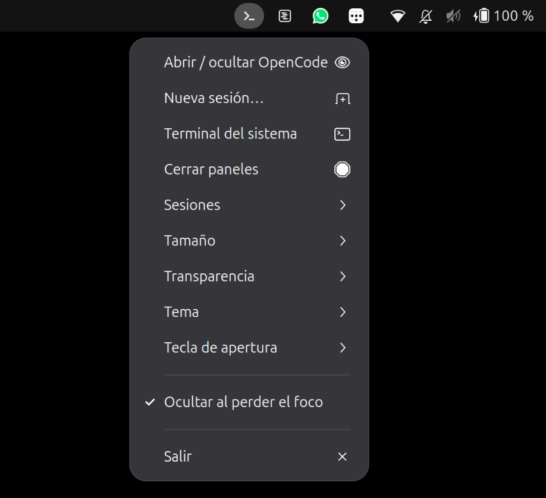
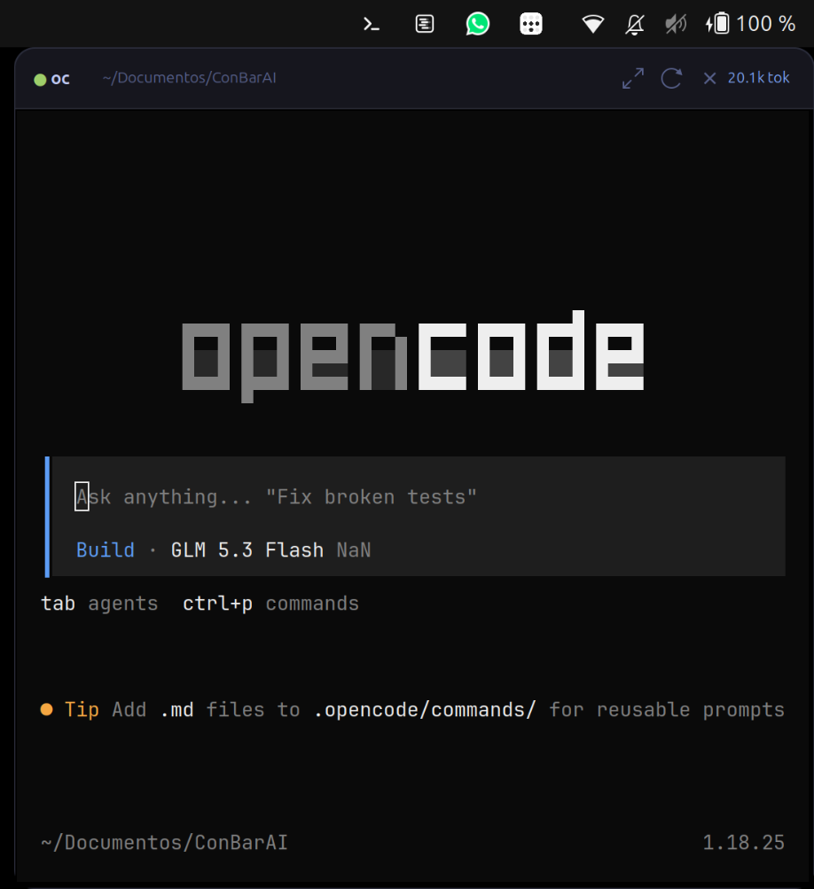

# ConBarAI

Panel flotante estilo Omarchy con **OpenCode** para Ubuntu GNOME.




Dedicado a este sistema (no es el OpenCode general del sistema: esta
instancia tiene y tendrá funciones propias).

Dos rutas distintas:

- **Proyecto (este código)**: `~/Documentos/OpenCode/ConBarAI`
- **Carpeta de ejecución**: `~/Documentos/ConBarAI` — ahí trabaja siempre
  el OpenCode del panel (sesiones, ficheros que genere, etc.)
Un icono en la barra superior abre u oculta una ventana flotante anclada en
la esquina superior derecha, justo debajo de la barra, con esquinas
redondeadas, sombra y tema **Tokyo Night**.

La sesión corre en `tmux` (sesión `oc`): puedes ocultar el panel y OpenCode
sigue trabajando en segundo plano.

## Características

- Multi-sesión: cada carpeta de trabajo es un panel independiente
  (sesiones tmux `oc`, `oc-<carpeta>`...), desde el menú **Sesiones**.
- Alertas: cuando la TUI hace "campana" (OpenCode pide atención) suena una
  notificación, el icono del tray pasa a ámbar y el punto de la cabecera a
  amarillo; se limpia al abrir el panel.
- Spinner en cabecera e icono animado mientras el agente consume CPU.
- Contador de tokens (y coste si lo hay) de la carpeta en la cabecera,
  leído de la base de datos de OpenCode.
- Temas: Tokyo Night, Catppuccin, Dracula, Gruvbox (`theme`).
- Botón de maximizar/restaurar el panel en la cabecera.
- Tipografía JetBrains Mono Nerd Font con detección automática (`font`).

## Requisitos

- Ubuntu con GNOME (probado en GNOME 50, Wayland; la ventana usa XWayland)
- `python3-gi` + `gir1.2-vte-2.91` + `gir1.2-ayatanaappindicator3-0.1`
- `wmctrl`, `xdotool`, `tmux`
- `opencode` en el PATH

## Instalación

```bash
./install.sh
```

Hace lo siguiente:

- Enlaza `oc-drop` y `oc-tray` en `~/.local/bin`
- Instala el icono en `~/.local/share/oc-drop`
- Registra el autostart del tray (`~/.config/autostart/oc-tray.desktop`)
- Crea el atajo de teclado **Super+A** (si no hay atajos personalizados)

Después, cierra sesión y entra de nuevo (o ejecuta `oc-tray` a mano) para
ver el icono en la barra.

## Uso

| Acción | Resultado |
| --- | --- |
| `Super+Intro` (o el atajo configurado) | Abre u oculta el panel |
| Icono del tray | Menú con apertura, tamaño, transparencia y tecla |
| Botón de recarga en la cabecera | Nueva sesión (cierra y relanza OpenCode) |
| Botón de cierre en la cabecera | Oculta el panel |
| Clic fuera del panel | Se oculta solo (autohide, configurable) |

La cabecera muestra un punto verde (sesión viva) o rojo (sesión muerta) y
la carpeta de trabajo.

## Ajustes

`~/.config/oc-drop/settings.json`:

```json
{
  "autohide": true,
  "autostart": true,
  "workdir": "/home/r/Documentos/ConBarAI",
  "width": 0.34,
  "height": 0.62,
  "opacity": 0.97,
  "keybinding": "<Super>Return",
  "terminal": "auto",
  "theme": "tokyo-night",
  "font": "auto",
  "font_size": 10
}
```

| Clave | Significado | Rango |
| --- | --- | --- |
| `autohide` | Ocultar el panel cuando pierde el foco | true / false |
| `autostart` | Arranca el tray al iniciar sesión (también en el menú del tray) | true / false |
| `workdir` | Carpeta de ejecución de OpenCode. Vacío = `~/Documentos/ConBarAI` | ruta |
| `width` | Ancho del panel (fracción del área de trabajo) | 0.15 - 0.90 |
| `height` | Alto del panel (fracción del área de trabajo) | 0.20 - 0.95 |
| `opacity` | Opacidad del panel | 0.50 - 1.00 |
| `keybinding` | Atajo global de apertura. `""` = desactivado | `<Super>Return`, `<Super>a`, ... |
| `terminal` | Terminal del sistema (menú del tray). `auto` = Ghostty si está, si no el que haya | `auto` o nombre del binario |
| `theme` | Tema del panel | `tokyo-night`, `catppuccin`, `dracula`, `gruvbox` |
| `font` | Tipografía de la terminal. `auto` = JetBrains Mono Nerd si está | `auto` o familia |
| `font_size` | Tamaño de la tipografía | 7 - 16 |

Los cambios de tamaño y transparencia se aplican la próxima vez que se abre
el panel. Desde el icono de la barra también hay presets listos: menús
**Tamaño** (Pequeño / Mediano / Grande / Máximo), **Transparencia**
(Opaco / Suave / Fuerte) y **Tecla de apertura** (Super+Intro / Super+A /
Sin atajo).

## Seguridad y confianza

Todo es local, en el espacio del usuario:

- Los nombres de sesión se validan con charset cerrado (`^[a-z0-9][a-z0-9_-]{0,47}$`)
  antes de usarse en rutas, hooks de tmux o notificaciones.
- Los hooks de tmux solo crean un marcador en `~/.local/state/oc-drop/alerts/`
  (directorio 0700) y lanzan `notify-send`. No ejecutan nada del contenido
  del terminal.
- Los ajustes y registros se guardan con permisos 0600 en directorios 0700.
- La base de datos de OpenCode se abre en modo solo lectura (tokens/coste).
- No hay red: ninguna función hace peticiones externas.
- `install.sh` puede instalar OpenCode con el instalador oficial
  (`curl ... | bash`): revisa el guion si prefieres otro método.

## Limitaciones conocidas

- La ventana usa XWayland (así se puede posicionar en GNOME); con varios
  monitores se ancla al borde derecho del espacio virtual combinado.
- La detección de "trabajando" es una heurística de CPU (~10%).
- El nombre de la sesión sale del nombre de la carpeta: dos carpetas con
  el mismo nombre comparten sesión.

## Probado en

- Ubuntu 26.04, GNOME Shell 50 (Wayland), tmux 3.6, Ghostty 1.3, VTE 2.91.

## Estructura

```
ConBarAI/
├── oc-drop      Panel flotante (GTK3 + VTE sobre XWayland)
├── oc-tray      Icono de la barra (AppIndicator)
├── oc_common.py Módulo compartido (ajustes, alertas, tmux, consumo)
├── tests/       Tests unitarios (pytest)
├── icons/       Iconos del tray
├── autostart/   Plantilla de entrada de autostart
├── applications/ Plantilla de entrada del menú de Aplicaciones
├── screenshots/ Capturas del README
├── install.sh   Instalador
├── uninstall.sh Desinstalador
└── pyproject.toml  Configuración de ruff y pytest
```

## Changelog

Historial de cambios en [CHANGELOG.md](CHANGELOG.md). Versión actual: **1.0.0**.

## Licencia

MIT — ver [LICENSE](LICENSE).

## Desarrollo

```bash
ruff check .        # análisis estático
python3 -m pytest   # tests unitarios
```

## Desinstalación

```bash
./uninstall.sh
```
